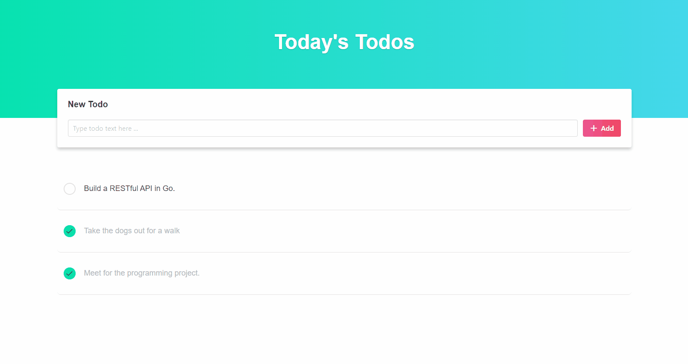

# MyToDo Application

MyToDo is a simple but effective web application built with Angular, TypeScript, and SCSS. It allows users to create, edit, and delete tasks, as well as mark them as complete. The app features a user-friendly interface built with SCSS and Bulma, fluid animations, and leverages Angular's powerful features such as data binding, dependency injection, and modular architecture. Additionally, I incorporated responsive design principles to ensure the app is accessible across different devices.

## Preview

## Features

MyToDo application comes with the following features:

* Adding new task
* Editing existing task
* Delete existing task
* Marking task as complete
* User-friendly interface with SCSS and Bulma
* Fluid animations
* Responsive design

## Architecture

MyToDo application follows Angular's modular architecture. The application is divided into the following components:

* **app component**: The root module of the application.
* **todos component**: Contains services, models and funtionalities that are used throughout the core application.
* **todo items component**: Contains services, models and functionalities related to the todo items (tasks).
* **edit todo dialog component**: Contains services, models and functionalities related to the case in which the user edits a todo item.
* **shared component**: Contains services, models and functionalities that are shared across multiple components.

## What I Learned

During the development of MyToDo application, I learned the following:

* **Angular**: I gained a better understanding of Angular's powerful features, such as data binding, dependency injection, and modular architecture.
* **TypeScript**: I learned the basics of how to use TypeScript's features, such as classes, interfaces, and generics, to write more robust and maintainable code.
* **SCSS**: I learned how to use SCSS's features, such as variables, mixins, and functions, to write more flexible and reusable stylesheets.
* **Bulma**: I learned how to use Bulma's components and utility classes to build responsive and modern user interfaces.

## Installation

To install and run MyToDo application, follow these steps:

1. Clone the repository: `git clone https://github.com/davidandw190/MyToDo-ANGULAR.git`
2. Install dependencies: `npm install`
3. Run the application: `ng serve`

The application should open in your default browser at `http://localhost:4200`

## Running unit tests

Run `ng test` to execute the unit tests via [Karma](https://karma-runner.github.io).

## Running end-to-end tests

Run `ng e2e` to execute the end-to-end tests via a platform of your choice. To use this command, you need to first add a package that implements end-to-end testing capabilities.
